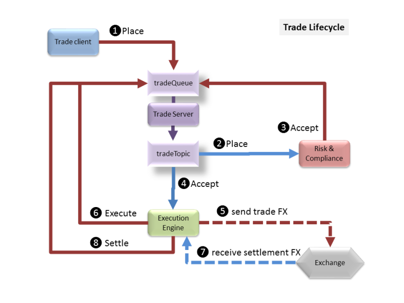

# Application Overview

A simple Trade Reporting Application is provided as the basis for building a more functional Trading System. The overall architecture of the system is shown below:


## Contents

[TOC]

# Trade Reporting Server

The sample application is used to record the current state of intra-day trades: all trades are cleared from the system as part of End-Of-Day reconciliation. The application is a simplified representation of a stage in a multi-stage trade processing system.

## Trade Overview

A trade is a **Buy** or **Sell** of a Stock and records the trade **Price** (in dollars) and the **Volume** of the trade. A trade has a unique **Transaction ID** and a placement **Date & Time**. Trades follow a defined lifecycle managed by other applications within the trading system:

* **Place** - a trade has been placed into the system but not yet processed
* **Modify** - the initial trade details have been amended and multiple updates are allowed - only Placed or Modified trades can be modified
* **Accept** - the trade has passed risk and compliance requirements and is waiting execution
* **Deny** - the trade has not passed risk and compliance
* **Cancel** - the trade was cancelled – only Placed, Modified or Accepted trades can be cancelled
* **Execute** - the trade has been sent to the exchange
* **Settle** - the trade has been confirmed by the exchange as completed
* **Reject** - the trade has been rejected by the exchange

The reporting system records the current trade **Status** and the time & date the **status was last changed**: no historical record of trade state changes is kept.

## Trade Lifecycle

A successful trade starting from a trading client (Trader desktop app or automated trading engine) is placed into the system. The execution engine receives the placed trade, verifies it meeets all trading risk and compliance requirements and sends an accept authorisation to the system. The execution engine receives the accept message and sends the trade to the appropriate external exchange (FTSE, NYSE, ...) and sends an internal execute message to te system. When the external exchange sends back the settlement details the execution engine sends a final settled message to the system.



Alternate decision points:

* Risk & Compliance sends a deny message if the trade is not allowed
* Execution Engine receives a rejected response from the external exchange and sends a reject trade message

A completed trade can be in one of the following end states: **settle**, **deny** or **reject**.

Note that the Risk & Compliance may involve manual (or automated intervention) with feedback to the trader to allow a trade to be modified so it can meet compliance requirements. A modified trade message will follow the same compliance assessment as a placed message. Once a message has been accepted (or denied) it can no longer be modified.

# Build Notes

This is a teaching application and contains examples of the Java Language used in a best practise manner. The application is not complete and only pays lip service to JavaDoc comments, Logging and JUnit testing - just enough to show the concepts.

## Build, Test & Run

The example uses Maven 2 to manage dependencies and command line builds.

To build an executable JAR from the command line (in the top level directory where the **pom.xml** file is located) use:

```
mvn package
```

Or a quicker build without running any Unit tests:

```
mvn -Dmaven.test.skip=true package
```

To just run the **Unit Tests**:

```
mvn test
```

To verify the build you will need an external MySQL server configured with the trade
table (see MySQL section) and run the **Integration Tests** using the verify goal:

```
mvn verify
```

## Run Trade Server

There will be two JAR files in the **target** sub-directory:
* target/trade-app-0.0.1.jar
* target/trade-app-0.0.1.jar.original

The first is the full trade server and all required JAR files suitable for running using the
Spring Boot launcher, the second is the build JAR file containing the trade server classes
which is suitable distributing as a library JAR.

**Note:** The version number may be different - check what is in the POM.

**Note:** You will need an external MySQL server (see MySQL section) and external ActiveMQ server (see ActiveMQ section) running in order to run the trade server.

The simplest way to run the server for demonstrations is to run the server in **production** mode via Maven:

```bash
mvn spring-boot:run
```

Once running you can browse to to see the GUI interface:
* [http://localhost:8080](http://localhost:8080)

The index page has a few simple links to show functionality and forms for adding/modifying trades.
At the bottom of the index page is a link to an Angular JS GUI which can also be used to add/modify
trades and change trade states (accept, execute, settle, ...).

In production mode the server displays INFO log messages so you can see activity. Change the
**com.neueda.trade** property in the **application-prod.properties** file to WARN to
show warning messages or higher on the console. All messages are also logged to the
file **trade-record.log** in the startup directory.

To run the server from the command line without Maven use:

```
java -jar trade-app-0.1.0.jar
```

**Note:** Check the version number against the POM to ensure you are using the correct JAR file.

To run using the production propertis (application-prod.properties);
```
java -Dspring.profiles.active=prod -jar trade-app-0.1.0.jar
```

## Injector

The Trade Server JAR includes a standalone application that can be used to inject simulated trades
into the server using either the REST interface or the ActiveMQ trade queue. The Injector uses an
external ActiveMQ server which means the Trade Server must be running in **production** mode (run
using Maven as above).

To run the injector use Maven with the *injector* profile:

```bash
mvn -Pinjector spring-boot:run
```

To run from the command line use the Spring Boot launcher included in the JAR file and
indicate the main name:

```bash
java -cp target/trade-app-0.1.0.jar -Dloader.main=com.neueda.trade.injector.Injector org.springframework.boot.loader.PropertiesLauncher
```

The trade server injects a specified trades and moves them through a full (successful) trade cycle;
it can be configured to inject _faulty_ trades.

The **application-injection.properties** file contains three properties used to control
the injector load:

* **trade.injector.limit** - how many trades to inject, or zero for unlimited
* **trade.injector.freq** - average rate trades are injected defined in trades per hour
* **trade.injector.error.rate** - percentage of fault trades

A fourth property is use to select the delivery mechanism: REST (default) or ActiveMQ.

The injector varies the speed of delivery of trades messages and may delivery two messages one
immediately after the other. The frequency is only a guide to how much load the injector can
put on the trade server.

Trades are based on a small set of Stocks configured in the sample database and uses trade
prices varying around values quoted on the different stock exchanges in summer 2017: FTSE
GBP prices are converted to USD prices.

## MySQL Database

Create a new **trades** schema and add a user called **trades** (password **trades**) and grant them full access to the schema.

A MySQL script to create the tables with some initial data is in the **src/data** folder.

Start the database before running the trade server.

## ActiveMQ JMS Server

The trade server is configured to use and internal ActiveMQ server for development and testing and requires no additional configuration.

To run in production mode the trade server and requires an ActiveMQ server running. Use the
ActiveMQ console at [http://localhost:8161/admin](http://localhost:8161/admin) add the following destinations
required by the trade server:

* **tradeQueue** a queue for sending upstream messages to the server
* **tradeTopic** a durable topic for sending downstream activity notifications

Messages are put on the queue and topic as **TextMessages** with the object data encoded as JSON (to avoid Serialization). Each message is also tagged with an **Operation** property which is used as a select filter on the queue listener methods. Properties are:

* **Add** add new trade - JSON trade in message
* **Update** add new trade - JSON trade in message
* **Cancel** cancel trade - JSON trade transaction ID in message
* **Accept** accept trade - JSON trade transaction ID in message
* **Deny** accept trade - JSON trade transaction ID in message
* **Execute** execute trade - JSON trade transaction ID in message
* **Settle** settle trade - JSON trade transaction ID in message
* **Reject** reject trade - JSON trade transaction ID in message

Possibly this should be on a different *tradeAdmin* queue?

* **EOD** end of day reconciliation - JSON date in message (TODO: not implemented)

Start the ActiveMQ server before starting the trade server.

# Developer Notes

## Trade REST Server

The trade server package is **com.neueda.trade** and the application is structured into the following sub-packages:

* **client** a couple of standalone clients used for JMS manual testing
* **injector** the trade injector classes
* **server** the main server packages and config classes to define required subsystems

The server main class is **com.neueda.trade.server.TradeServer** class and the injector
main class is **com.neueda.trade.server.Injector**.

The trade server package **com.neueda.trade.server** comprises:

* **activemq** ActiveMQ configuration
* **database** DAO and DTO concrtete classes for database access
* **jms** JMS configuration
* **jmx** JMX beans supporting monitoring
* **messaging** JMS trade queue listener and topic sender
* **model** DAO and DTO interfaces
* **monitoring** statistics and data gathering classes
* **mysql** MySQL support classes and DAOs
* **rest** REST controllers for trades, stocks and markets and Swagger support (dev only)
* **rules** business logic classes for enforcing data integrity and other constraints

The REST application relies on default exception handling methods in **rest.DefaultExceptionHandler**  and
**rest.TradeExceptionHandler** for catching exceptions and mapping these onto responses to the client (typically JSON for REST clients).

The JMS support defines an exception handler static class in **jms.JmsConfiguration** which logs
any errors.

Any business rule checks in the code also *throw* exceptions rather than use *try/catch* blocks so that all error responses are defined in this one class.

## Web Client

The web client files are stored in the Maven standard location for Web applications: **src/main/webapp**.

The **index.httml** files provide:

* links to basic REST services list list trades
* a form to create a trade
* a link to the Swagger pages for manual testing
* a link to an example GUI

The example GUI uses Angular JS and Bootstrap for

* listing trades
* modifying a trade
* cancelling a trade
* creating a new trade
* changing trade state

## Testing

There are minimal tests suites to show how to develop TDD style tests without proving all of the required tests for the application. Completion of the testing (so called *Legacy Testing*) is intended to be an activity for the students.

Mock object tests using Mockito (included with Spring Boot) show a basic mocking approach for DAOs and Messaging. Again fairly minimal to allow students to add additional Mock tests if required.

* **Unit Tests** have class names matching __*Test__ (Maven surefire plugin standard).
* **Integration Tests** have class names matching __*IT__ (Maven failsafe plugin standard).

## Logging

There is basic LogBack logging to support monitoring configured in **logback.xml**. The default spring logging
is not included so that all logging is controlled through this configuration file.

**Note** that client errors (badly formed JSON, invalid attributes) are logged as WARN messages.

## JMX Monitoring

A simple statistics gathering bean in **monitoring.JmxTradeMonitor** collects statistics for trades in different lifecycle states.

To see the monitoring metric:

1. launch **bin/jmc.exe** (Windows) or **bin/jmc.sh** (Linux) in your JDK directory; on OSX use Spotlight to locate JMC or look for **Contents/Home/bin/jmc** in your JDK folder
2. On the left is a list of all your running JVMs:
    * if you used Maven spring-boot:run to launch the trade server, locate and expand the **org.codehaus** app (it will have **spring-boot** in the name)
    * if you are using eclipse locate and expand __com.neueda.*.TradeServer__.
3. Double click on **MBean Server** underneath or Right Click and select **Start JMX Console**
4. Take a look at all the fancy metrics if you like
5. Click on the **MBean** tab at the bottom of the screen
6. Expand the package with **com.neueda.trade** in the name
7. Click on any of the beans and examine that property
8. Every time you click a bean you will see the new values for the properties

You can also link a statistic to the dials or a graph on the JMX console:

1. Select the **Overview** tab on your **MBean Server**
2. To add a dial click on the **+** sign on the dashboard and open the row starting **com.neueda.trade**
3. Open the **TradeStats** bean and select one of the statistics
4. If this is the first time you have chosen the statistic you will have to click on **Next** and click in the **Content Type** cell and select **Number**
5. Click on **Finish** to add the dial
6. To remove the dial Right Click on the dial and select **Delete**
7. You can keep adding more dials to the **Dashboard** but they will soon overflow
to the right and there is no scroll bar (you have to enlarge the window) but can delete the
standard dials if you want to add more trade statistics dials
8. To add a chart of trade statistics click on the **+** on the **Overview** at the top of the console
9. On the new chart click on the **+** and select your statistic as you did for the dial
10. You can add multiple statistics to the same chart.
11. To remove a statistic Right click on the statistic name in the charter legend and select **delete**
12. To remove a chart click on the **x** close icon. You can also open and close individual charts with the triangle by the chart name.

### Running the APP for JMX connectivity over a URI
If you are not running the application as a Developer you will want to ensure that JMX is exposed over a URI method.  To do this you should launch the JAR file as follows;
```
java -Dcom.sun.management.jmxremote -Dcom.sun.management.jmxremote.port=9990 -Dcom.sun.management.jmxremote.authenticate=false -Dcom.sun.management.jmxremote.ssl=false -jar trade-app/target/trade-app-0.1.0.jar
```
The above will expose JMX via *hostname*:9990

# Training Notes

Design and idiom points of interest (package names relative to **com.neueda.trade**):

* JavaDoc comments primarily in the **server.rules.Model** class
* Generic functions in the **server.rules.Model** class
* Static inner classes in the __mysql.MySql*Dao__ and **jms.JmsConfiguration** classes
* Java 8 streams in **server.rules.Model.stringInList** method
* Java 8 lambdas in **server.messaging.TradeTopicSender**
* Java 8 method references in **server.rules.Operations**
* Java 8 using interfaces as method reference parameters in **server.monitoring.MonitoringTest**
* Concurrent blocking queues in test **server.messaging.MockMessageingTest** class
* Java countdown latch in **client.SendTradeActiveMq**
* User defined exceptions in the **server.config.*Exception** classes
* Use of logging replacement parameters to avoid concatenation or String.format in **server.rest.DefaultExceptionHandler**
* Mock testing with *Mocks* and *Spys* in the test __server.*.Mock*Test__ test classes
* Factory Pattern in **server.model.DtoFactory** and **server.database.DatabaseFactory**
* State machine in **server.rules.Model** and lookup in **server.rules.Operations** rather than complex **if/switch** statements
* DI all over the place: try **server.rest.RestTradeController** and test **server.messaging.MessagingTest**
* Spring profiles to configure inclusion of subsystems in __server.config.Config*__ , **injector/Injector** and **injector/ActiveMqClient**

One thing to point out is that the Java code in the trade server is almost trivial: very few **if**  or **for**
statements and no **while** loops, minimal arithmetic or string manipulation. It's all about moving data around
and letting the frameworks (Spring, JDBC Templates, Rest Templates, JMS Templates and Jackson) do the heavy lifting.
